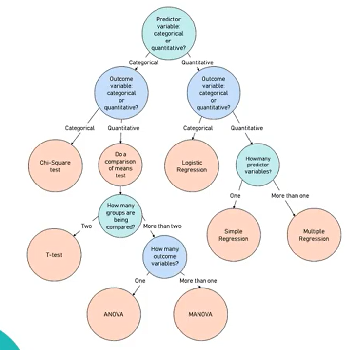

# Statistics - parametric and nonparametric

>If Data is Gaussian\
    Use Parametric Statistical Methods\
Else\
    Use Nonparametric Statitical Methods

## Background of parametric and nonparametric statistics

>In parametric statistics, the information about the distribution of the population is known and is based on a fixed set of parameters.
>
>In nonparametric statistics, the information about the distribution of a population is unknown, and the parameters are not fixed, which makes is necessary ?>to test the hypothesis for the population.

### Flow Chart for selecting statitical test

### 1. Parametric Tests

Parametric statistics are based on assumptions about the distribution of population follows normal distribution from which the sample was taken

#### Basic Assumption of Parametric Statistics tests

- Random Samples (True representation of Population)
- Normality test (data must follow Guassian/ Normal Distribution)
- Homogenity Test (Equal Varience of multiple groups)
- Interval/Ratio level of measurement of Outcome variables
  
### Common parametric Tests

#### 1.a- Test Family Chi-Square

    - Purpose:  Comparision(Differences)
    - Data:     Categorical
  
> 1.a.1 -  Chi-Square Test of Homogenity\
> 1.a.2 - Chi-Square Test of Independence

#### 1.b- Test Family t-Test/ANOVA

    - Purpose:  Comparision(Differences)
    - Data:     Categorical/Continious
  
>t-Test\
> 1.b.1 - One Sample t-Test   (One sample/group with known mean)\
> 1.b.2 - Two Sample t-Test\
> 1.b.2a - Paired t-Test   (same sample/group twice )\
> 1.b.2b - Unpaired t-Test (two different sample groups)\
>
>ANOVA\
> 1.b.3 - One way ANOVA               (even 1 sample/group is significant leads to significant results,doesn't tell which one)\
> 1.b.4 - Two way ANOVA\
> 1.b.5 - Repeated measures of ANOVA  (3+ paired samples/groups)(Scale up of Paired t-Test)

#### 1.c- Test Family Correlation

    - Purpose:  Relationship(Connection)
    - Data:     Continious
  
> 1.c.1 - Pearson's Correlation (1 independent variable-1 dependent variable)---(how closely conneceted these variable are)\
> 1.c.2 - Linear Regression (1 independent variable-1 dependent variable)---(specefic math equation that can predict un measeaured data points)
---

### 2. Non Parametric Tests

Nonparametric statistics are not based on assumptions, that is, the data can be collected from a sample that does not follow a specific distribution.

#### Basic Assumption of Non Parametric Statistics tests

- Randomness
- Independence
- Unknown Distribution

### Common Non Parametric Tests

#### 2.a- Test Family Chi-Squared

    - Purpose:  Comparision(Differences)
    - Data:     Categorical
  
> 2.a.1 - Chi-Square Test of Homogenity\
> 2.a.2 - Chi-Square Test of godness of fit\
> 2.a.3 - Chi-Square Test of Independence

#### 2.b- Test Family t-Test/ANOVA

    - Purpose:  Comparision(Differences)
    - Data:     Categorical/Continious
  
>t-Test\
> 2.b.1  - One Sample Willcoxon Signed Rank Test\
> 2.b.2  - Two Sample t-Test\
> 2.b.2a - Willcoxon Test\  
> 2.b.2b - Mann Whitney's U Test\
>
>ANOVA\
> 2.b.3  - Kruskal Wallis Test

#### 2.c- Test Family Correlation

    - Purpose:  Relationship(Connection)
    - Data:     Continious
  
> 2.c.1 - Spearman's Correlation\
> 2.c.2 - Kendal Tau Test\
> 2.c.3 - Logistic Regression

---
